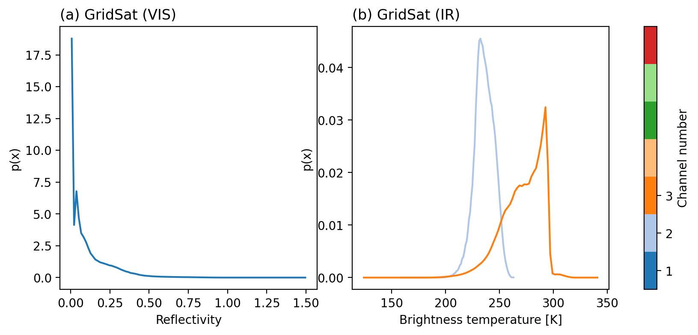
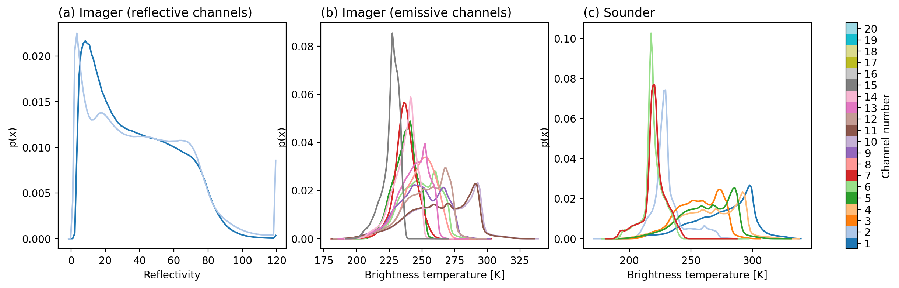

# S2S precipitation forecast task: Overview

## Task

The task of the 'S2S precipitation forecast' downstream application is to
predict the evolution of daily accumulated surface precipitation fields up to
several weeks into the future. The input data for this task consists of daily
gridded satellite observations from eight consecutive days. The satellite
observations comprise visible (VIS), infrared (IR) and microwave observation
derived from both polar-orbiting and geostationary platforms. The prediction
targets are daily accumulations of precipitation for the 28 days following the
last available satellite observations.

## Data collection and processing

### Satellite observations

The satellite observations that comprise the forecast input data are derived from
three different climate data records of historical satellite observations. In order to maximize the temporal extent of available training data, the observations are limited
to channels that were available from the 1980s until the present.

#### Geostationary visible and infrared observations

Geostationary observations were extracted from the [GridSat
B1](http://doi.org/10.7289/V59P2ZKR) dataset (Knapp et al., 2011). The dataset
contains geostationary observations at three spectral bands in the visible and
far infrared regions. The observations are available from 1980 until 2023 at a
temporal resolution of 3 h. For each given day, the eight available observations
are combined into a single file, resulting in a total of 24 observations per
day. The observations are regridded from their native resolution to the MERRA
grid using nearest neighbor interpolation.

#### Polar-orbiting visible and infrared observations

In addition to the observations from the geostationary platforms, visible and
infrared observations are also extracted from the Pathfinder Atmospheres
Extended (PATMOS-x) Fundamental Climate Data Record (Foster et al., 2021). The
observations are derived from the Advanced Very High Resolution Radiometer
(AVHRR) and High-resolution Infra-Red Sounder (HIRS) sensors flown on the NOAA's
and EUMETSAT's operational weather satellites. Although their temporal
resolution is inferior to those of the geostationary observations, they provide
a higher number of channels and global and more consistent spatial coverage.

The PATMOS-x data is available as daily gridded observations from polar-orbiting
satellites from ascending and descending orbits. Both ascending and descending
orbits contain observations from 15 imager channels in the visible and infrared
domains and 8 infrared sounding channels. The exact channels wavelengths are
listed in the two tables below. For each day, the available observations are combined and regridded to the MERRA grid using linear interpolation. The total number of available observations per day thus amounts to 46.

| Imager channel | Wavelength [um] |
|----------------|-----------------|
| 1              | 0.65            |
| 2              | 0.85            |
| 3              | 1.6             |
| 4              | 3.75            |
| 5              | 4.46            |
| 6              | 4.52            |
| 7              | 6.7             |
| 8              | 7.3             |
| 9              | 9.7             |
| 10             | 11.0            |
| 11             | 12.0            |
| 12             | 13.3            |
| 13             | 13.6            |
| 14             | 13.9            |
| 15             | 14.2            |

| Sounder channel | Wavelength [um] |
|-----------------|-----------------|
| 1               | 3.75            |
| 2               | 4.45            |
| 3               | 4.47            |
| 4               | 11.0            |
| 5               | 12.0            |
| 6               | 14.5            |
| 7               | 14.7            |
| 8               | 14.9            |

#### Polar-orbiting passive microwave observations

The SSMI data consists of microwave observations from polar-orbiting satellites.
Due to their comparatively long wavelength, microwave observations penetrate
clouds and therefore provide sensitivity to the surface even when its cloudy.
Moreover, passive microwave observations over ocean are directly sensitive to
the thermal emission from rain drops.

The SSMI observations comprise seven channels, whose frequencies are listed in
the table below. The data is distributed on the native sensor sampling. The data
is gridded by combining all observations from descending and ascending orbits
for a given day and resampling them to the MERRA grid using nearest-neighbor
interpolation.

| Channel | Frequency [GHz] | Polarization |
|---------|-----------------|--------------|
| 1       | 19              | H            |
| 2       | 19              | V            |
| 3       | 22              | V            |
| 4       | 37              | H            |
| 5       | 37              | V            |
| 6       | 85              | H            |
| 7       | 85              | V            |

### Surface precipitation data

The forecast target data is derived from two climate records of
daily-accumulated surface precipitation: The PERSIANN CDR (Soroosh, 2014) and
IMERG Final (Huffman, 2014). The PERSIANN CDR estimates the daily distribution
of surface precipitation using geostationary observations, whereas IMERG
combiend observations from both geostationary and polar-orbiting passive
microwave observations. IMERG is generally considered the state-of-the-art of
space-borne precipitation estimation, however, it is only available from the
year 2000 onwards. Estimates from PERSIANN, on the other hand, are available
already from 1983 onwards. The estimates from both products are bias corrected
to match montly accumulations from gauge measurements and thus climatologically
consistent with in-situ measurements.

For the extraction of the forecast target data, PERSIANN is used from 1983 until
June 2000, while IMERG is used after June 2000. The figure below shows

## Evaluation metrics and methodology

The precipitation forecasts are evaluated by calculating area-weighted weekly
correlations between the predicted daily precipitation accumulations and the
corresponding observed precipitation derived from the gauge-corrected satellite
precipitation datasets.

### Baselines

The forecasts are evaulated against two baselines: A ML-based model and
NWP-based forecasts from ECMWF and the UK Met Office.

#### NWP baseline

S2S forecasts from ECMWF and the UK Met-Office (UKMO) are used a conventional
NWP baselines. Andrade et al. (2019) found these models to yield the best
S2S precipitation forecasts in an evaulation over 10 forecasting systems.
They thus constitute an ambitious baseline for ML-based forecasts.
The benchmark data
used here has been extracted from the ECMWF S2S database (Vitart, 2017) for the years 2019
until 2023.

#### ML baseline

The ML baseline forecast is an autoregressive encoder-decoder architecture. The
structure of the model is illustrated in the figure below. To produce a
forecast, the model first encodes observations from each day independently using
a shared encoder. The encoded observations are then concatenated and propagated
through two temporal encoders each of which produces one of the initial input
states for the autoregressive forecast. A propagator in the form of an
encoder-decoder network then produces latent model states for all requested lead
times. Finally, each latent model state is decoded using a shared decoder to
produce the precipitation forecasts.

### Methodology

Forecasts are evaluated using on the bias, the mean-squared error and the
linear correlation coefficient of predicted daily precipitation accumulations
for forecasts of up to 28 days. The metrics are calculated over the latitude
range from -60 degree to 60 degree as an area-weighted mean over all forecast
steps. The models will be ranked using the evolution of those accuracy metrics
with the forecast lead time. The model that performs best is the one the
achieves the lowest errors and highest correlations for the longest lead.

### Baseline results

The figure below shows the average daily precipitation accumulations for the
four weeks of the forecast period. The uppermost row shows the reference data,
the second row the ECMWF forecast and the final row the machine-learning-based
forecast.

## EDA

### Input data

#### Geostationary visible and infrared observations

The distributions of the three channels of the geostationary visible and infrared input data are displayed in the figure below.

#### Polar-orbiting visible and infrared observations

The distributions of the 15 imager and 8 sounders channels of the polar-orbiting visible and infrared input data are displayed in the figure below.

#### Polar-orbiting passive microwave observations

The distributions of the 7 channels of the polar-orbiting passive microwave  input data are displayed in the figure below.

### Target data

The PDF of target daily accumulated precipitation and the precipitation
climatology are shown in the figure below. Overall, rain occurs in 47.2 % of
valid target pixels and the average daily precipitation is 2.82 mm.

#### 

## References 

de Andrade, Felipe M., Caio AS Coelho, and Iracema FA Cavalcanti. "Global precipitation hindcast quality assessment of the Subseasonal to Seasonal (S2S) prediction project models." Climate Dynamics 52.9-10 (2019): 5451-5475.

Knapp, K. R., S. Ansari, C. L. Bain, M. A. Bourassa, M. J. Dickinson, C. Funk, C. N. Helms, C. C. Hennon, C. D. Holmes, G. J. Huffman, J. P. Kossin, H.-T. Lee, A. Loew, and G. Magnusdottir, 2011: Globally gridded satellite (GridSat) observations for climate studies. Bulletin of the American Meteorological Society, 92, 893-907.  doi:10.1175/2011BAMS3039.1

 Foster, Michael J.; Phillips, Coda; Heidinger, Andrew K.; and NOAA CDR Program (2021): NOAA Climate Data Record (CDR) of Advanced Very High Resolution Radiometer (AVHRR) and High-resolution Infra-Red Sounder (HIRS) Reflectance, Brightness Temperature, and Cloud Products from Pathfinder Atmospheres - Extended (PATMOS-x), Version 6.0. NOAA National Centers for Environmental Information. https://doi.org/10.7289/V5X9287S [December 2023].

Huffman, G.J., E.F. Stocker, D.T. Bolvin, E.J. Nelkin, Jackson Tan (2019), GPM IMERG Final Precipitation L3 1 day 0.1 degree x 0.1 degree V06, Edited by Andrey Savtchenko, Greenbelt, MD, Goddard Earth Sciences Data and Information Services Center (GES DISC), Accessed: [Data Access Date], 10.5067/GPM/IMERGDF/DAY/06

Sorooshian, Soroosh; Hsu, Kuolin; Braithwaite, Dan; Ashouri, Hamed; and NOAA CDR Program (2014): NOAA Climate Data Record (CDR) of Precipitation Estimation from Remotely Sensed Information using Artificial Neural Networks (PERSIANN-CDR), Version 1 Revision 1. [indicate subset used]. NOAA National Centers for Environmental Information. doi:10.7289/V51V5BWQ [access date]

Vitart, F., and Coauthors, 2017: The Subseasonal to Seasonal (S2S) Prediction Project Database. Bull. Amer. Meteor. Soc., 98, 163–173, https://doi.org/10.1175/BAMS-D-16-0017.1. 
